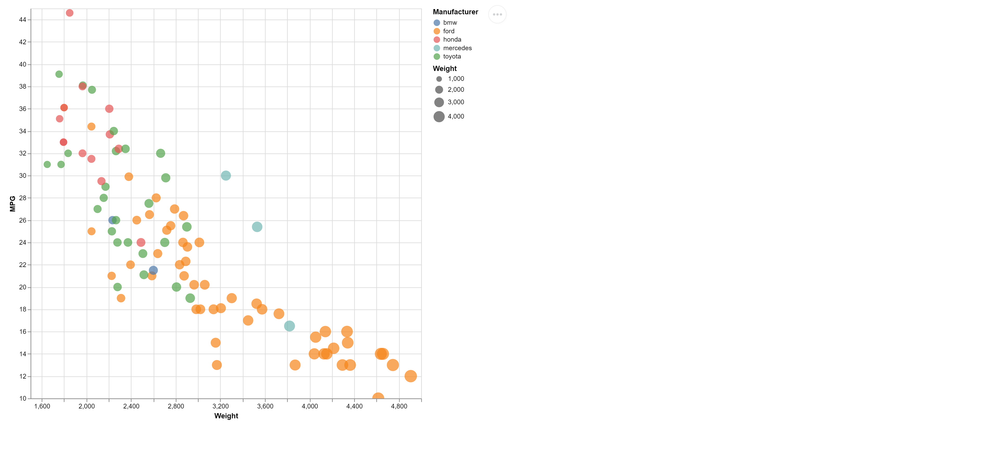

# 02-DataVis-7ways

Assignment 2 - Data Visualization, 7 Ways  
===

# d3

`./index.html`

Since the rest of the course makes use of d3, and it was required for this assignment, I made once of my visualizations using d3. I did a couple of clever things using javascript to make certain things easier (ex: using a reducer to get unique values for the manufacturers so that I could categorize the data and color each manufacturer differently).

After reading some of the docs on `d3-axis`, I was able to make some axes that don't start at 0 and have the axis tick marks.

The trickiest part of the d3 implementation was getting the axis labels. I couldn't really find a "d3" way to do this, so I just appended some svg text nodes and positioned them using CSS.


# chart.js

`./chartjs.html`

Chart.js is a much more "high level" charting library than d3, and makes use of the HTML5 Canvas rather than building SVG elements. It's very interactive by default, and is relatively simple to get setup on a web page.

For this implementation, I needed to fetch and parse the CSV myself and format it as JSON to match how Chart.js likes it (unlike d3 which has some helper methods for this). I also needed to split the data up into different "datasets" in order for Chart.js to categorize them according to the manufacturer, as well as write my own functions for finding the min and max of the car's weights and scaling the radius of each bubble.


# excel

`./cars-sample.xlsx`

Making this chart in excel was surprisingly challenging because of the categorization. The best way that I found to do it was to make a new column for each manufacturer and use a small equation to pull values only for the rows that match that manufacturer. Something like `=IF($Manufacturer="ford",$Weight,NA())` for each manufacturer, which wasn't so bad in this case since there are only a handful of different manufacturers. If there were many categories, I'm sure there would be a more clever solution using pivot tables or other "excel magic," but this simple solution worked great for me.


# R + ggplot

`./main.r`

I'm not much of an R user, so after installing R and RStudio, I had to do a bit of googling to figure out how to make a bubble chart that resembles the example we were given. The online example I ended up following was very basic, and was really only 1 line of code after importing the CSV. I was surprised by how easy it was to generate this chart.

The tutorial I followed consisted of some more advanced options to add some style to the chart, but I omitted those as I didn't fully understand the code, and I don't like not understanding the code I write. Given a larger project and more time, I might explore some more of the docs to develop a stronger understanding of R. It's definitely a powerful and valuable tool, so I would be happy to learn some more of it.

Source/example I followed: https://www.r-graph-gallery.com/320-the-basis-of-bubble-plot.html


# Python + Plotly

`./main.py`

Although I'm certainly not an expert, I know quite a bit of python. I'd heard of plotly before so I decided it would be good to give that library a try. It was super easy to find documentation and examples online, and it actually felt very similar to the R code (as in it was very declarative when it came to specifying the axes & data points that I wanted to plot). This library was also "1 line of code" after importing the data, and it was very easy to understand, so I can definitely see why people like Python and this library for data viz tasks.


# Vega Lite (Javascript Edition)

```
./vega.html
./cars-sample--vega-spec.json
```

I wasn't super excited to try Vega Lite at first, but once I took a look at the schema and browsed a few examples, I completely changed my mind about it. I think the concept of "describing your data viz as a schema" is super interesting, and the schema was much more versatile than I originally thought.

I also found that they publish some javascript libraries, allowing you to easily embed Vega charts in any web page, so I decided to give that a try. The documentation was *okay* - I really wanted to get the `Vega.js View API` working, but I was having trouble getting the chart to actually render out to the page, so I ended up using the `Vega Embed API` which was much easier. You essentially just include some js libs and give it the schema and the rest is magic.



# Java 2D

```
./java/src/BubbleChart.java
./java/src/Main.java
```

*This was fun :)*

I was feeling adventurous for my final data visualization, so I decided to try to write my own implementation using the Java 2D Graphics API. This took **hours** to get even a basic chart working and all scaled correctly to make sure it was accurate. I tried to make everything "data-driven," so that when instantiating the `BubbleChart` class you can choose what variables to find in the CSV and use for each axis.

Parsing data, accounting for padding/margins, making room to draw the axes, manually drawing the labels and tick marks, and handling bad data took far longer than I'm willing to admit, but doing this implementation from scratch in Java gave me a deeper appreciation for both Web technologies and visualization libraries. In the future, I will not make visualization using Java 2D Graphics, but I had fun doing it.

*As a side note, it is also embarrassingly slow at rendering when transparency is enabled, so I'll willingly accept that my code is inferior to other libraries and tools.*


## Technical Achievements
- **Java BubbleChart implementation**: Wrote a fully custom BubbleChart class from scratch in Java using nothing but my own two hands.

### Design Achievements
- **Made use of patternomaly in Chart.js implementation**: Rather than using basic colors to categorize the bubbles in the chart, I made use of a convenient plugin that generates patterns with colors and applies them as the background of the chart.js elements.
